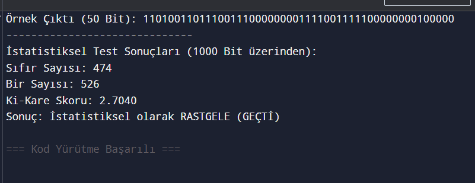

# Collatz PRNG

Bu proje, **Collatz Teoremi** tabanlı bir Sözde Rastgele Sayı Üreteci (PRNG) çalışmasıdır.

### Özellikler:
- **Matematiksel Temel:** Kaotik bir yapı sunan Collatz (3n+1) dizisi kullanılmıştır.
- **İstatistiksel Denge:** Von Neumann düzeltmesi ile 0 ve 1 oranları %50-%50 dengelenmiştir.
- **Güvenlik:** 24-bit başlangıç entropisi ile orta seviye bir karmaşıklık sunar.

### Kullanım:
`collatz.py` dosyasını çalıştırarak dengeli rastgele bit dizileri üretebilirsiniz.

## İstatistiksel Analiz ve Test Sonuçları

Algoritmanın ürettiği sayıların rastgeleliği, 1000 bitlik bir örneklem üzerinden Ki-kare (Chi-Square) testi ile doğrulanmıştır.

### Test Verileri:
- **Sıfır (0) Sayısı:** 474
- **Bir (1) Sayısı:** 526
- **Ki-Kare Skoru:** 2.7040
- **Kritik Değer (p=0.05):** 3.841

### Sonuç:
Hesaplanan skor (2.7040) kritik değerin altında olduğu için algoritma **rastgelelik testinden başarıyla geçmiştir.**

